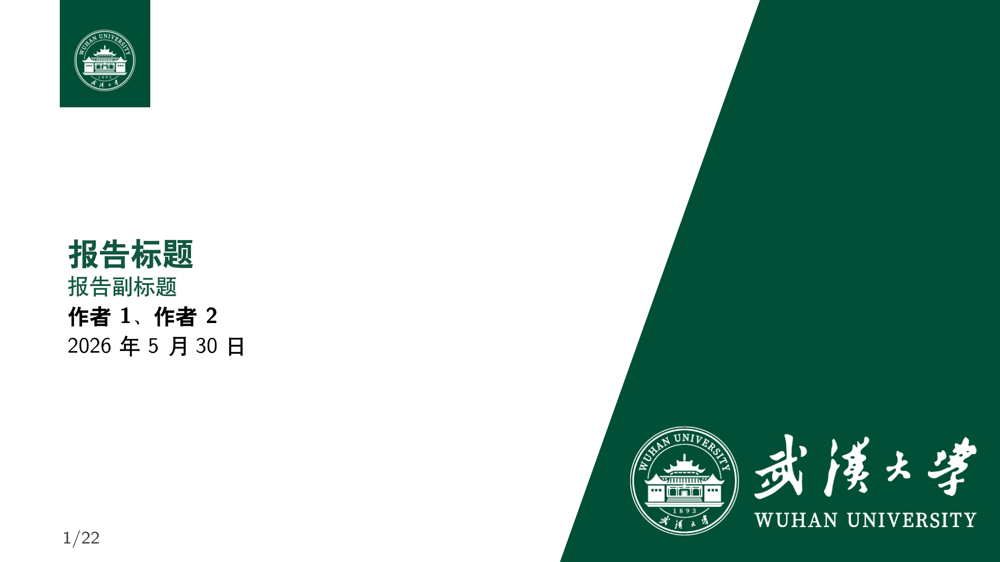
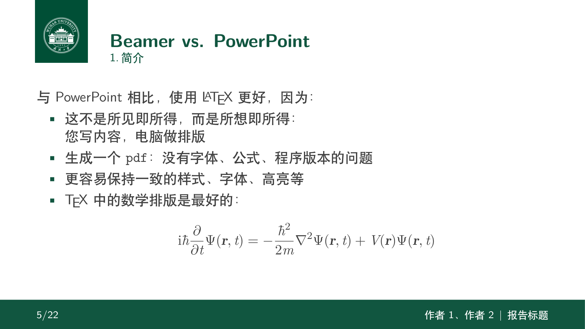

# WHU Chinese Beamer Template

[](LICENSE)

武汉大学 (WHU) 风格的中文 Beamer 幻灯模板，基于 **SINTEF Presentation** 主题。

A Wuhan University (WHU) themed Chinese Beamer template, based on the **SINTEF Presentation** theme.

## 预览 / Preview

| 标题页 / Title | 内容演示 / Content |
|---|---|
|  |  |

## 快速开始

```bash
xelatex whu_beamer.tex
xelatex whu_beamer.tex
xelatex whu_beamer.tex
```

需要编译 2-3 次以确保目录、页码等正确渲染。

Compile 2-3 times to ensure TOC, page numbers, etc. are correctly rendered.

## 依赖 / Dependencies

- **TeX Live**（推荐完整安装）
- `ctex` + `fandol` 字体（或自行更换 `ctex` 字体集）

## 自定义

### 基本信息

在 `whu_beamer.tex` 导言区修改：

```latex
\title{报告标题}
\subtitle{报告副标题}
\author{作者1、作者2}
\date{\today}
```

### 标题页背景

```latex
% 全屏背景
\titlebackground{assets/background}

% 分割视图背景（标题左侧留白，右侧显示图片）
\titlebackground*{assets/background}
```

### 主题颜色

本模板颜色定义在 `sintefcolor.sty` 中，主色为武大珞珈绿（`maincolor`，RGB: 17,87,64）。

色块颜色选项：`sinteflightgreen`、`sintefgreen`、`sintefdarkgreen`、`sintefyellow`、`sintefred`、`sinteflilla`、`sintefgrey`。

页脚颜色可中途切换：

```latex
\footlinecolor{maincolor}      % 默认
\footlinecolor{sintefyellow}   % 黄色
\footlinecolor{sintefgreen}    % 绿色
```

### 幻灯片样式

```latex
\themecolor{white}  % 白底（默认）
\themecolor{main}   % 珞珈绿底白字
```

### 特殊幻灯片环境

```latex
% 章节幻灯片（带背景图）
\begin{chapter}[assets/background_negative]{maincolor}{章节标题}
  ...
\end{chapter}

% 侧图幻灯片
\begin{sidepic}{assets/background_alternative}{幻灯片标题}
  ...
\end{sidepic}
```

## 文件结构 / Structure

```
WHU-Chinese-Beamer-Template/
├── whu_beamer.tex            # 主模板文件
├── beamerthemesintef.sty     # SINTEF Beamer 主题
├── sintefcolor.sty           # SINTEF 颜色定义
├── ref.bib                   # 示例参考文献
├── assets/                   # 图片资源
│   ├── background.png
│   ├── background_alt.png
│   ├── background_alternative.jpg
│   ├── background_negative.png
│   ├── background_negative_alt.png
│   ├── logo_RGB.png
│   ├── logo_RGB_alt.png
│   └── logo_RGB_negative.png
├── README.md
├── LICENSE                   # GPL-3.0
└── .gitignore
```

## 致谢 / Credits

本模板修改自：

- **[SINTEF Presentation](https://www.overleaf.com/latex/templates/sintef-presentation/jhbhdffczpnx)** — 原始 Beamer 主题，由 Federico Zenith 提供
- **[Beamer-LaTeX-Themes](https://github.com/TOB-KNPOB/Beamer-LaTeX-Themes)** — 中间衍生版本，由 Liu Qilong 提供

WHU 风格改编（珞珈绿配色 + 校徽 + 背景图片）。

## 许可 / License

本项目基于 **GPL-3.0** 许可协议发布（继承自上游 SINTEF 主题）。

See the [LICENSE](LICENSE) file for details.
